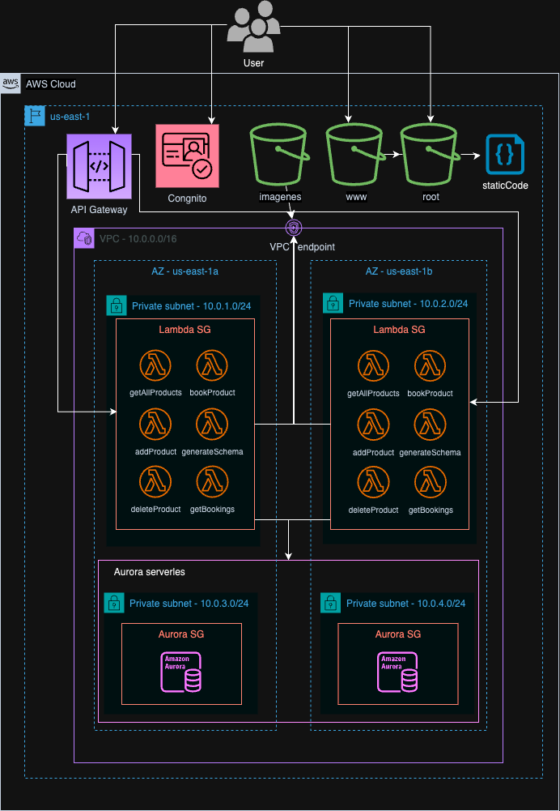

<h1 align="center" href="https://docs.aws.amazon.com/?nc2=h_ql_doc_do&refid=d4b6ebcb-1bab-48ea-bd64-310bd8b10d2a" style="display: block; font-size: 2.5em; font-weight: bold; margin-block-start: 1em; margin-block-end: 1em;">
<a name="logo"></a>
  <br /><br /><strong><em>PickItUp</em> - Cloud Computing Project</strong>
</h1>

## Table of contents[](#table-of-contents) 
- [Table of contents](#table-of-contents)
- [Descripción del proyecto ](#descripción-del-proyecto-)
- [Cómo correr el proyecto ](#cómo-correr-el-proyecto-)
- [Arquitectura ](#arquitectura-)
- [Requerimientos TP3 ](#requerimientos-tp3-)
  - [Módulo externo (vpc)](#módulo-externo-vpc)
  - [Módulo interno (web-app)](#módulo-interno-web-app)
  - [Módulo interno (api-gw)](#módulo-interno-api-gw)
- [Descripción de meta-argumentos](#descripción-de-meta-argumentos)
  - [for\_each](#for_each)
  - [depends\_on](#depends_on)
  - [lifecycle](#lifecycle)
- [Descripción de funciones](#descripción-de-funciones)
  - [fileset](#fileset)
  - [split](#split)
- [Crear usuario administrador](#crear-usuario-administrador)


## Descripción del proyecto [](#descripción-del-proyecto) 

Este proyecto propone el desarrollo de una plataforma que permita a los usuarios visualizar productos disponibles, reservarlos y recogerlos en un punto físico.

## Cómo correr el proyecto [](#cómo-correr-el-proyecto) 

Situado en la raíz del proyecto, corremos el siguiente ejecutable:
- MacOS:
  ```./script-mac run```
- Linux:
  ```./script-linux run```
- Windows:
  ```./script.exe run```

## Arquitectura [](#arquitectura) 


## Requerimientos TP3 [](#requerimientos-tp3) 

### Módulo externo (vpc)
Se trata de un módulo que nos permite configurar de manera simple la VPC de nuestra infraestructura.

### Módulo interno (web-app)
La idea de este módulo es que contenga todo lo relacionado al despliegue de una página estática en S3. A partir de un nombre de dominio y el directorio donde residen los archivos estáticos nos da en su salida el id de los buckets correspondientes y de la URL a través de la cual podemos acceder a la página.

### Módulo interno (api-gw)
Este módulo simplifica el despliegue de un API Gateway utilizado para una API HTTP a partir de las lambdas correspondientes a cada endpoint y la ruta y método a partir de la cual se accederá.

## Descripción de meta-argumentos

### for_each
- Se utiliza en ```lambda.tf``` para poder iterar sobre archivos del directorio y comprimir todos los archivos de funciones lambda.
- Se utiliza en ```lambda.tf``` para poder iterar sobre archivos del directorio y publicar los lambdas de cada archivo.
- Se utiliza en ```web-app/storage.tf``` para poder reusar la configuración de los recursos asociados a los buckets raíz y de www.
- Se utiliza en ```web-app/storage.tf``` para poder agreagar al bucket todos los archivos estáticos de la página web al bucket S3.
### depends_on
- Se utiliza en ```cognito.tf``` para crear la user pool de clientes luego de configurar el identity provider de Google.
- Se utiliza en ```database.tf``` para crear el cluster de Aurora una vez que se creó su parameter group correspondiente y para invocar la lambda que genera el schema de datos luego de que el cluster ya está creado.
- Se utiliza en ```lambda.tf``` para crear los Lambda una vez que se deplegó el cluster de Aurora (ya que las mismas interactúan con la base de datos).
- Se utiliza en ```s3.tf``` y en ```web-app/storage.tf``` para crear adjuntar la policy de los buckets una vez que se habilita esta posibilidad en la configuración pública del mismo. 
### lifecycle
- Agrega una capa de seguridad extra en ```database.tf``` para evitar borrados accidentales del inventario de los clientes.

## Descripción de funciones
### fileset
- Se utiliza en ```datasources.tf``` para poder iterar sobre los distintos archivos del directorio que contieenen las funciones lambda.
### split
- Se utiliza en ```datasources.tf``` para obtener el nombre de la lambda a partir del nombre de la carpeta donde se encuentra.

## Crear usuario administrador[](#crear-usuario-administrador) 
Algunos endpoints del sistema requieren permisos adicionales, ya que ciertas funcionalidades, como la gestión de reservas o la adición de stock, están restringidas exclusivamente para los administradores del sistema. Por defecto, los usuarios no tienen acceso a estos permisos.

Para habilitar el acceso a estos endpoints administrativos, deben seguirse los siguientes pasos:

- Acceder a la consola de AWS Cognito.
- Dirigirse al user pool llamado `cloud-user-pool`.
- Seleccionar el usuario al que se desea otorgar permisos.
- En la sección Group memberships, agregar al usuario al grupo `product-admins`.
- De esta manera, el usuario tendrá los permisos necesarios para interactuar con los endpoints restringidos a administradores.